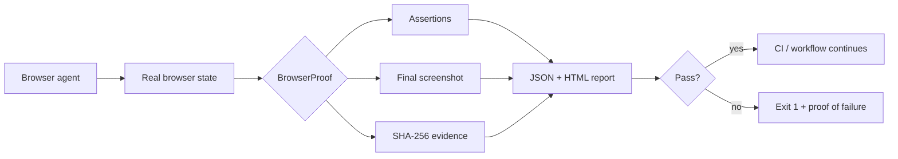

<p align="center">
  
</p>

<p align="center">
  <a href="https://github.com/yashkhou/browserproof/actions/workflows/ci.yml"></a>
  <a href="https://github.com/yashkhou/browserproof/releases/latest"></a>
  <a href="./LICENSE"></a>
  
  <a href="https://yashkhou.com/projects/browserproof"></a>
</p>

<p align="center">
  <strong>Proof, not vibes, for browser agents.</strong><br>
  Evidence-first verification for browser automation and AI agents. BrowserProof makes “done” a testable browser state instead of a confident sentence.
</p>

<p align="center">
  <a href="https://yashkhou.com/projects/browserproof"><strong>Project page</strong></a> ·
  <a href="./docs/real-report.html"><strong>Report fixture</strong></a> ·
  <a href="https://github.com/yashkhou/browserproof/releases/latest"><strong>Latest release</strong></a>
</p>


## Why I built this

Browser agents are good at acting and surprisingly bad at proving that the requested state was actually reached. A workflow can land on the wrong page, miss a save, or attach an irrelevant screenshot and still report success. BrowserProof adds a small verification layer after the agent run.

## What ships today

- Explicit URL and title assertions
- Required text and visible-selector checks
- Input-value verification
- Final full-page screenshot capture
- SHA-256 evidence hash
- Portable JSON + human-readable HTML report
- Non-zero exit code on failed proof

## Real demo


**[Inspect the report fixture →](./docs/real-report.html)**

## Quick start

```bash
git clone https://github.com/yashkhou/browserproof.git
cd browserproof
npm install
npx playwright install chromium
npm run build
node dist/cli.js run example.json
```

## Small example

```json
{
  "url": "https://example.com",
  "assertions": [
    { "type": "titleIncludes", "value": "Example" },
    { "type": "text", "value": "Example Domain" }
  ]
}
```

## Architecture



The design rule is intentionally narrow: **verification happens after the browser action, against observable state.**

## Good fits

- Verify AI browser/computer-use tasks before marking them complete
- Gate Playwright workflows in CI
- Attach evidence to QA and incident reports
- Catch false-positive “success” from autonomous browser agents


## FAQ

### What is BrowserProof?

BrowserProof is a TypeScript verification layer for AI browser agents and Playwright workflows. It checks explicit browser-state assertions and emits portable proof artifacts with deterministic pass/fail results.

### What problem does BrowserProof solve?

It separates execution from verification so an automation cannot treat a confident agent message as evidence that the browser actually reached the requested state.

### Does BrowserProof replace Playwright?

No. It uses Playwright as the browser runtime and adds an evidence-focused verification/reporting layer around the final state.

### Can BrowserProof run in CI?

Yes. Failed assertions return a non-zero exit code and successful runs produce machine-readable JSON and human-readable HTML proof reports.

## Roadmap

- [ ] Perceptual screenshot assertions
- [ ] Signed proof bundles
- [ ] GitHub Action annotations
- [ ] Adapters for common computer-use agents
- [ ] Replay timeline

## Related tools

- [BrowserProof](https://github.com/yashkhou/browserproof) - browser-state verification for AI agents and Playwright workflows.
- [RunLedger](https://github.com/yashkhou/runledger) - tamper-evident execution history for AI-agent runs.
- [ActionMesh](https://github.com/yashkhou/actionmesh) - typed action contracts for tools, HTTP and CLI.

## Development

```bash
npm install
npm test
npm run build
```

CI runs tests and the TypeScript build on every push and pull request.

## Project links

- **Docs source:** [docs/](docs/)
- **Project page:** https://yashkhou.com/projects/browserproof
- **Source:** https://github.com/yashkhou/browserproof
- **Author:** [Yash](https://github.com/yashkhou) / [@yashkhou](https://x.com/yashkhou)

## License

MIT. See [LICENSE](./LICENSE).
